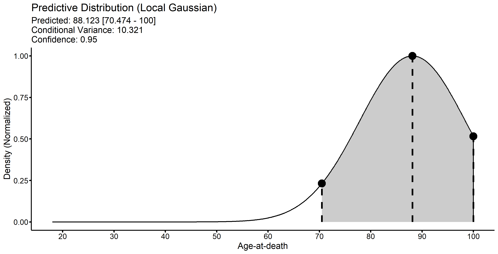

---
output:
  md_document:
    variant: markdown_github
---

```{r, echo = FALSE}
knitr::opts_chunk$set(
  fig.path = "man/figures/"
)
```

# lgpr: regression uncertainty from local gaussian distributions

This package provides a simple interface for computing and plotting
predictive intervals for regression task when assuming a gaussian
distribution of the errors is reasonable. Since the scale of the
gaussian can be specific to a data point, the predictive intervals are
local in the sense that they can adapt to the variance associated to a data
point.

# Install
```r
# install.packages("devtools")
devtools::install_github(repo = "dsnavega/lpgr")  
```

# Usage
```r
# Load lgpr
library(lgpr)
# Build and lgpr model for a single prediction
object <- lgpr(
  location = 88.123, scale = 10.321, interval = c(18, 100), alpha = 0.05
)
# Compute predictive interval at 95% Confidence (1 - alpha)
prediciton <- predict(object)

# Plot predictive interval with ggplot2
plot(object)
```
In the **Usage** example given the location and scale arguments define the 
point estimate and variance of the regression model for a fictitious data point
in a forensic age-at-death estimation problem. This approach is agnostic to how
the location and scale are computed, is up to the user to come up in modelling
strategy that computes such variables.

## Example

